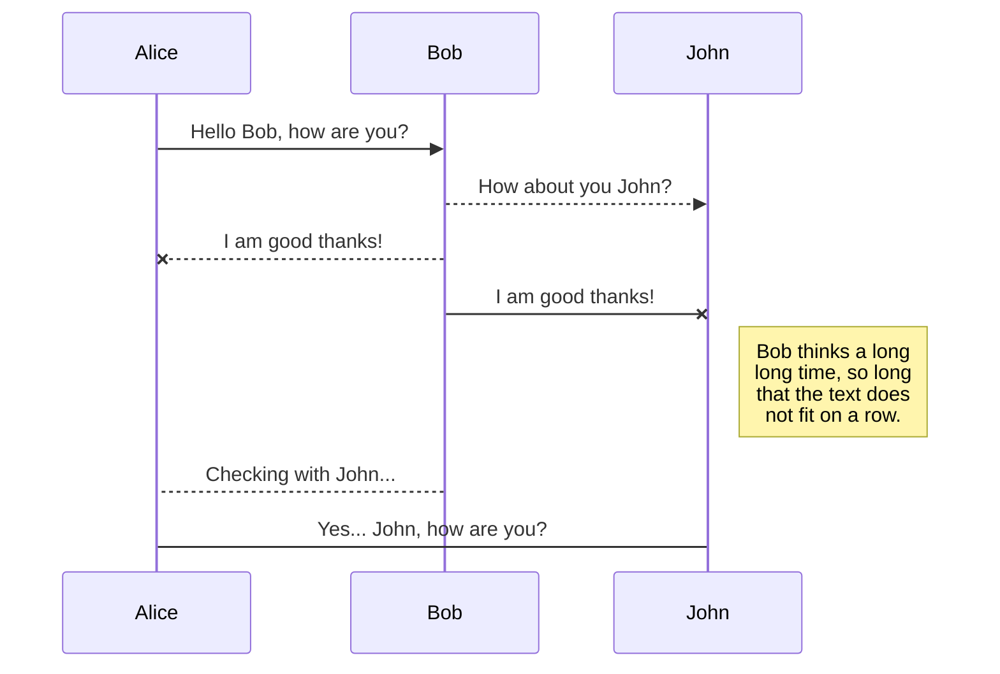

# GridSimulator

Le programme permet aux utilisateurs de:

    - Construire un réseaux
    - Implémenter les différents type de centrale et de consommateur
    - Implémenter une simulation de météo
    - Implémenter une simulation des marchés
    - Implémenter un centre de contrôle permettant d'agir sur la production des centrales et sur la distribution des noeuds de distribution.
    - Obtenir le coût de production, les revenus et la quantité de CO2 produite à chaque seconde.
    - Obtenir des messages d'alerte: lignes surchargées, surproduction, sous-production, blackout, ...

# Installation
# Utilisation

## 1. Créer une nouvelle simulation / charger ancienne

Tout d'abord commencer par appuyer sur nouvelle simulation entrer un nom et un mot de passe avec minimum 
une majuscule un chiffre et minimum 6 caractères.

## 2. Construire un nouveau circuit électrique

### 2.1 Ouvrer la barre du haut et sélectionner editor

### 2.2 Créer les différents type producteurs du circuit 
- Sélectionner le type de producteur
- Entrer le nom
- Entrer les caractéristiques (Cout , CO2, Puissance max)

### 2.3 Créer les différents type consommateurs du circuit 
- Sélectionner le type de consommateur
- Entrer le nom
- Entrer les caractéristiques (Cout , Puissance max)

### 2.4 Commencer a créer votre circuit 
Ajouter progressivement les différents producteurs et consommateurs crée au par avant pour constituer le circuit électrique.

## 2. Lancement simulation

Une fois satisfait de votre circuit retourner dans l'onglet Dashboard du menu principale et appuyer sur le bouton play a droite de l'écran.

## 3. Analyse des résultats 

Vous avez plusieurs onglet disponibles contenant différentes informations 
### 3.1 Onglet Dashboard 
La partie Essentials qui résume toute les infos et affiche les log d'erreur.

La Node grid qui représente le système 

La puissance électrique produite et consommée 

Les émissions de CO2

L'argent dépensé pas le circuit 

### 3.2 Onglet Production
Affiche les producteurs et leurs émission de CO2

### 3.3 Onglet Consommation
Affiche les producteurs et leurs émission de CO2

### 3.4 Onglet Weathers
Affiche toute les données climatiques en fonction de l'heure.

## UML diagrams

You can render UML diagrams using [Mermaid](https://mermaidjs.github.io/). For example, this will produce a sequence diagram:

sequence diagram:

